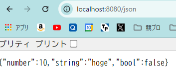

# JSONレスポンスを返してみよう

先ほど作った`main.go`に、レスポンスとして JSON を返すエンドポイントを追加しましょう。
:::tip
JSON について分からない人は
[JSONってなにもの？ | Think IT（シンクイット）](https://thinkit.co.jp/article/70/1)
:::

:::tip
Rust の構造体についてわからない人は↓を見ると良いです。

https://doc.rust-jp.rs/book-ja/ch05-01-defining-structs.html
:::

JSON をレスポンスとして返すためには、`Json` に構造体を渡します。  
先ほどの章で作成した`main.rs`に、以下のようなエンドポイントを追加して、`JSON`レスポンスを返してみましょう。

<<<@/chapter1/section3/src/2-1_json-server.rs

書き換えたら、<a href='http://localhost:8080/json' target="_blank" rel="noopener noreferrer">localhost:8080/json</a> にアクセスして確認してみましょう。



## Postmanでリクエストしてみよう

Postman を起動したら、workspace を作成して移動し、`Ctrl + N`->`HTTP`または`Overview`タブの横にある`+`を押して、リクエスト設定画面を開きます。


`Enter URL or paste text`とあるところで HTTP method と URL を指定できます。  
Postman を使って、GET リクエストを自分のサーバーに送ってみましょう。
つまり、`HTTP Method`として`GET`を使用して、URL`http://localhost:8080/hello`にリクエストを送信しましょう。

```
HTTP Method: GET

URL: http://localhost:8080/hello
```
以下の画像のように設定してください。


```
Hello, World.
```
と表示されれば成功です。

## 次に POST リクエストを使ってみましょう

POST ではサーバーにデータを送ることができます。

1. Postman で Body タブを選択
2. ラジオボタンの`raw`を選択
3. 右に出てくるプルダウンから`JSON(application/json)`を選択します  
POST で渡せるデータの型は複数あり、上記の操作で JSON を使うということを明示しています。

以下のように自分の traQ ID を POST してみましょう。

```
HTTP method: POST

URL: https://eo6mn2b7rlihmgg.m.pipedream.net
```
```json
{
    "traq_id": "pikachu"
}
```


`traq_id`が`pikachu`の例だと、上の画像のように、以下のような JSON が返ってきます。
```
{
    ...
    "body": {
        "traq_id": "pikachu"
    }
}
```

<!--
inspectある?
から自分のtraQ IDがあるか確認してみましょう
-->

## 自分のサーバーでPOSTを受け取ってみよう

POST で JSON を受け取って、内容をそのまま返すサーバーを作ってみます。  
`get()`と同じように、`post()`と書くことで POST を受け取ることができます。  
POST のハンドラでは `Result` 型を受け取っています。
パースに成功した場合は、match の中の Ok に入り、失敗した場合は Err に入ります。

<<< @/chapter1/section3/src/2-2_echo-server.rs

Postman を使って実際に受け取れている / 送り返せているか確認してみましょう。


